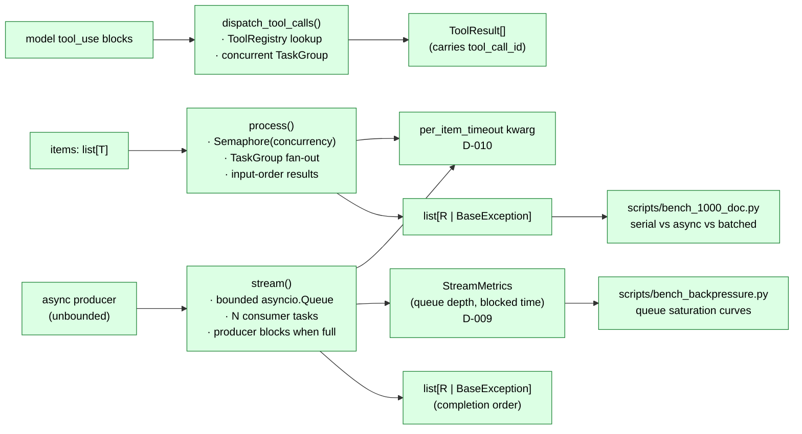
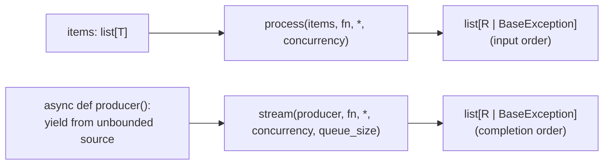
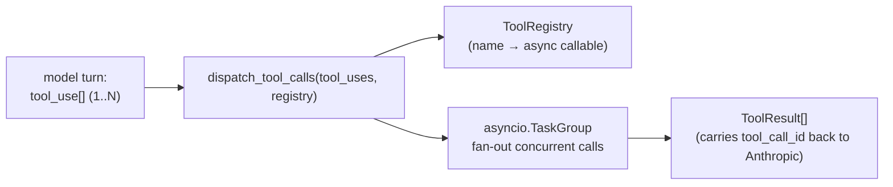
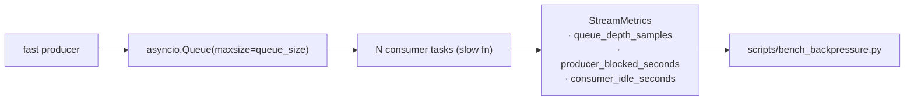
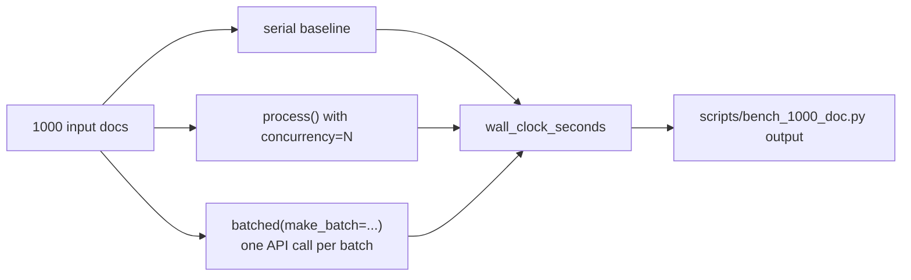
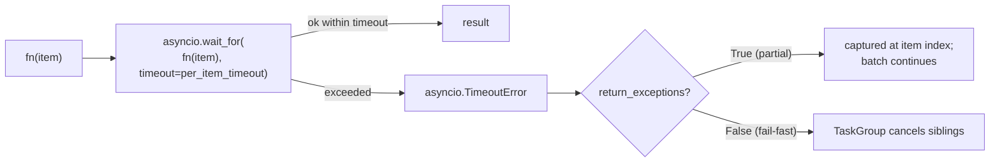

# Architecture

Five primitives ship: `process` and `stream` for the two fan-out shapes
(#1), `dispatch_tool_calls` for concurrent tool-use (#2), the
backpressure-instrumented `stream` (#3), a measured 1000-doc benchmark
(#4), and per-item timeouts on every primitive (#5). The package is
wrapper-runtime-dep-free (D-002) — `asyncio` + stdlib only at import.

## Integrated pipeline lifecycle

**Stack-level invariants.**

- The wrapper itself is dep-free (D-002): Anthropic / OpenAI / httpx
  are all optional. Consumers wrap their own caller in a Python
  `async def` and pass it as `fn`.
- Two completion orderings (D-003): `process` returns in *input* order
  so callers can zip results with inputs; `stream` returns in
  *completion* order so backpressure isn't defeated by index-preserving
  buffering.
- Two failure modes (D-006): fail-fast is the default (TaskGroup
  cancels siblings on the first exception); `return_exceptions=True`
  opts into partial tolerance and captures per-item failures at their
  index.

---

## 1. `process` and `stream`

**What they do.** Two primitives for the two fan-out shapes. `process`
is for a *materialized* input list; `stream` is for an unbounded
producer.

**Composes with.** Every downstream primitive (tool dispatch, the
benchmark, the per-item timeout) layers on these two. The timeout
kwarg lives on both signatures (D-010); the backpressure metrics
attach to `stream` (D-009).

**Why these decisions.**

- **D-002.** Wrapper-runtime-dep-free. `asyncio` + stdlib only.
  Consumers pass their own caller as `fn`.
- **D-003.** `process` returns input-order; `stream` returns
  completion-order. Forcing index-preservation on `stream` would
  defeat backpressure.
- **D-006.** Default is fail-fast (TaskGroup behaviour); opt into
  partial tolerance with `return_exceptions=True`.

---

## 2. Concurrent tool-call dispatch

**What it does.** When a model returns multiple `tool_use` blocks in
one turn, dispatch them concurrently and return per-call results.

**Composes with.** Sits in front of any agent loop that wants real
concurrency on tool-use. Reuses the same fail-fast / `return_exceptions`
posture as `process` (D-006).

**Why these decisions.**

- **D-004.** `ToolRegistry` is a thin dict wrapper — name → async
  callable. No inheritance, no decorator-based registration. The
  cookbook principle: a reader can copy the dispatch primitive
  without dragging in registry infrastructure.
- **D-005.** `ToolResult` carries `tool_call_id` so the round-trip
  back to the Anthropic API works without the caller threading
  per-call ids by hand.
- **D-006 (mirrored).** Same fail-fast default + opt-in
  `return_exceptions=True` as the rest of the package. One mental
  model.

---

## 3. Backpressure when sink can't keep up

**What it does.** `stream` already implements backpressure via the
bounded `asyncio.Queue` — issue #3 added the *measurement* surface
(`StreamMetrics`) and a benchmark script that produces saturation
curves on a slow sink.

**Composes with.** Reads only `stream` internals via a
keyword-only `metrics=` arg (D-009). The metric dataclass is updated
in-place; callers pass one in if they want telemetry, pass nothing if
they don't.

**Why these decisions.**

- **D-009.** `StreamMetrics` is an *in-place* dataclass passed via a
  keyword-only arg, defaulting to `None`. Callers who don't care pay
  zero cost; callers who do get a structured record. Mirrors
  `RunResult` patterns elsewhere in the portfolio.

---

## 4. 1000-doc benchmark

**What it does.** A real measurement of the serial-vs-async-vs-batched
performance multiplier. Uses a deterministic `FakeLLM` so CI exercises
the math; a real-API mode is a two-line operator swap (D-007) so the
numbers in `docs/benchmarks.md` correspond to actual measurement, not
an extrapolation.

**Composes with.** Reuses `process` / `stream` for the async and
batched modes. Doesn't depend on tool dispatch.

**Why these decisions.**

- **D-007.** `FakeLLM` is the CI-hermetic default; real-API mode is
  documented as a two-line caller swap. Same posture as
  llm-cost-optimizer's bench-savings and chunking-lab's matrix:
  hermetic CI, operator-triggered real numbers.
- **D-008.** Batched pipeline does one round-trip per batch via a
  `make_batch` caller seam — the caller decides how to pack
  individual items into a single API call (e.g., one prompt with N
  embedded sub-prompts, one tool call with N inputs).

**JSON observability surface (#44).** `Workload.to_dict()` /
`RunResult.to_dict()` pin the per-instance JSON contract so downstream
consumers (notebook, CI parser, dashboard) aren't coupled to
`dataclasses.asdict`'s greedy behavior. `async_pipelines.benchmark.dump_benchmark_json(path, *, workload, results)`
writes the combined `{"workload": ..., "results": [...]}` payload
atomically via `atomic_write_text` (D-011) — byte-identical to the
pre-#44 inline shape used by `scripts/bench_1000_doc.py`, so existing
parsers don't break. Mirrors the observability-parity pattern landed in
`rag-production-kit#51` (`TelemetryStore.dump_aggregate_json`),
`llm-cost-optimizer#51` (`PromptCacheWrapper.dump_aggregate_json`), and
`llm-cost-optimizer#53` (`SemanticCache.dump_stats_json`).

---

## 5. Per-item timeout + cancellation

**What it does.** A keyword-only `per_item_timeout` arg on `process`
and `stream` that wraps each `fn(item)` call in `asyncio.wait_for`.
Times out individual items without cancelling the rest of the batch
(when `return_exceptions=True`).

**Composes with.** Lives on both `process` and `stream` (D-010);
doesn't change tool dispatch's surface. Pairs naturally with
`return_exceptions=True` so a slow item doesn't kill the batch.

**Why these decisions.**

- **D-010.** Timeout is a kwarg on the primitives, not a separate
  `@timeout()` decorator. Decorators force the caller to pre-bind
  the timeout to the callable; kwargs let the caller pick a
  per-batch budget without re-wrapping. Reads naturally next to
  `concurrency=` and `return_exceptions=`.

---

## 6. Cross-cutting: atomic file writes (#36)

`async_pipelines/io_utils.py` exposes `atomic_write_text`, the
package-level helper that every benchmark script
(`scripts/bench_1000_doc.py`, `scripts/bench_backpressure.py`) calls
when persisting JSON results.
It writes to a `<dest>.tmp` sibling in the same directory, `fsync`s,
then `os.replace`s into place — operators reading the benchmark JSON
never see a half-written file from a `KeyboardInterrupt` mid-write.

**Why these decisions.**

- **D-011.** Helper lives at the package level (in
  `async_pipelines.io_utils`) rather than file-private to each
  script, matching the cross-repo standard (`rag_kit.io_utils`,
  `eval_harness.io_utils`, `emb_shootout.io_utils`,
  `prompt_regression.io`). Centralizes the `os.replace` surface to
  one monkey-patch target for the atomic-write test suite.

---

## Where to look next

- **Primitives** — `async_pipelines/core.py` (`process`, `stream`),
  `async_pipelines/tool_dispatch.py`.
- **Benchmarks** — `async_pipelines/benchmark.py`,
  `scripts/bench_1000_doc.py`, `scripts/bench_backpressure.py`,
  `docs/benchmarks.md`.
- **Design decisions** — `MEMORY/core_decisions_human.md` for prose,
  `MEMORY/core_decisions_ai.md` for the structured log.
