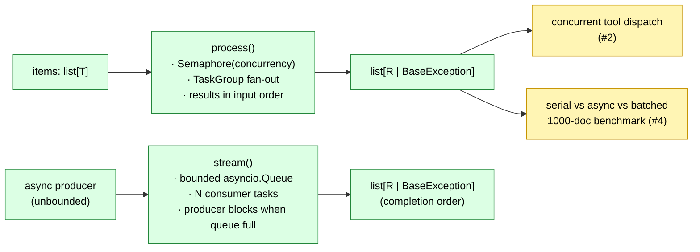

# Architecture

## Shipped (this PR — issue #1)

### `process(items, fn, *, concurrency, return_exceptions=False)`

Materializes the input into a list so results can be ordered. Spawns
one task per item inside an `asyncio.TaskGroup`; each task acquires an
`asyncio.Semaphore(concurrency)` before calling `fn`. Results land at
the matching input index.

- **Default (fail-fast):** TaskGroup cancels every sibling on the first
  exception. The raised exception will be either the original or
  wrapped in `ExceptionGroup` depending on call-site.
- **`return_exceptions=True`:** exceptions are captured per-item and
  the batch continues. Failures appear at their index in the output.

### `stream(producer, fn, *, concurrency, queue_size, return_exceptions=False)`

For unbounded sources. The producer pushes onto a bounded
`asyncio.Queue`; a fixed pool of `concurrency` consumer tasks drain it
through `fn`. When the queue is full, the producer's `put` blocks —
that's the backpressure signal.

Results land in **completion order**, not producer order. In a
streaming context the producer's index isn't usually meaningful, and
forcing index-preservation would defeat backpressure.

## Pending

- **Issue #2:** concurrent tool-call dispatch — when a model returns
  multiple tool_use blocks, dispatch them with `asyncio.TaskGroup` and
  surface partial failures.
- **Issue #4:** the 1000-document benchmark proving the 5–20× win.
  Requires a real LLM call shape, so deferred until either the
  Anthropic SDK adapter or a swappable provider interface is in place.
